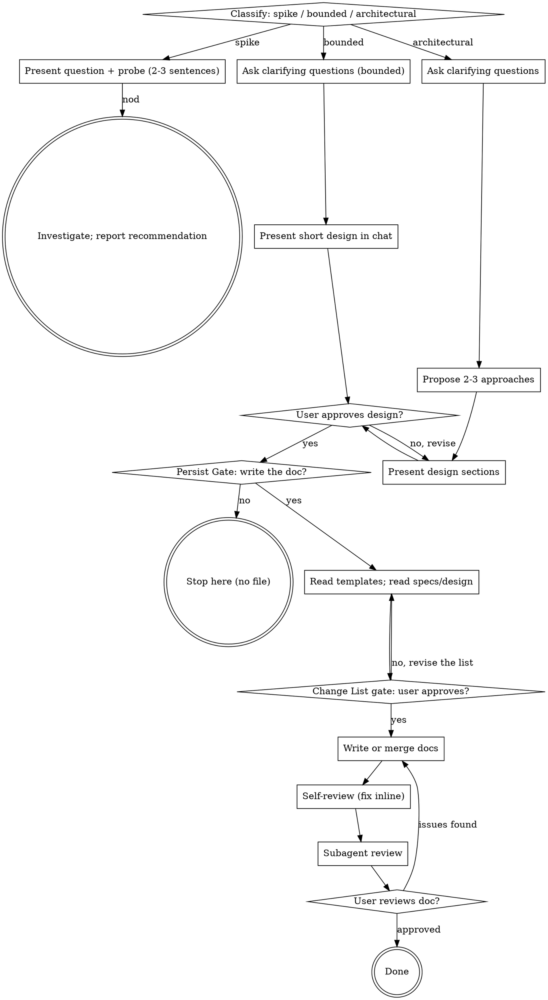

# Brainstorming Ideas Into Designs

Help turn ideas into fully formed designs through natural collaborative dialogue.

Start by classifying how much process the request needs, then work
through your path: understand the context, refine the idea, present a
design, and get your human partner's approval. Once the design has
settled and your human partner wants it kept, write it out as
human-readable design documents.

## Scope

**This skill only does this:** clarify intent → explore approaches →
settle the design → (with your human partner's consent) write a
human-readable design document.

**It does NOT:**

- write code, scaffold projects, or take any implementation action
- invoke any downstream skill — no writing-plans, no implementation skills
- produce spec-mode artifacts (requirement IDs, acceptance criteria,
  task lists, Given/When/Then)

**Where the output goes:** your human partner hands the design document
to a separate process (for example spec-superflow). This skill is not
responsible for that handoff.

<HARD-GATE>
Do NOT invoke any implementation skill, write any code, scaffold any
project, or take any implementation action until you have told your
human partner what you intend and they have approved it. This applies
to EVERY task on EVERY path below — the ceremony scales with the task;
the approval gate never does.
</HARD-GATE>

## Three Paths

Before your first question, classify the request and say the
classification out loud — "this looks bounded, so I'll present a short
design here rather than write a design doc" — so your human partner can
override it:

- **Spike** — a feasibility question ("can we...", "is it possible...",
  "quick and dirty is fine") whose output is an answer, not code you
  keep. Present the question and what you'll try in 2-3 sentences, get
  a nod, then find out as cheaply as correctness allows. No design
  doc. Report findings as a recommendation; anything you built stays
  labeled throwaway.
- **Bounded** — a well-scoped change to code that already exists in
  this repo: a new flag, a small endpoint, a one-file fix.
  Understanding the kind of app is not enough — bounded means the flow
  you are changing is already here to read. If there is no existing
  flow to change, the task is not bounded. Ask the clarifying
  questions that matter, present a short design IN CHAT (a few
  sentences to a few short paragraphs), and STOP. Implementation
  starts only after your human partner says yes to that design — a
  bounded task's approval is as hard a gate as an architectural
  one. No design doc is written during this step.
- **Architectural** — new projects, new subsystems, changes that
  restructure how components fit together or alter interfaces others
  depend on. Follow the full process: questions, approaches, sectioned
  design, then the Persist Gate.

When in doubt between two paths, take the heavier one. The ratchet is
one-way: hidden complexity discovered mid-task upgrades the path —
stop, say so, and step up. Nothing downgrades mid-task.

## Anti-Pattern: "Too Simple To Need Approval"

Every path ends with your human partner approving your intent before
implementation. A todo list, a single-function utility, a config
change — the design may be two sentences in chat, but you MUST present
it and get approval. "Simple" tasks are where unexamined assumptions
cause the most wasted work. What scales with simplicity is the
artifact, never the approval.

## Red Flags

| Thought | Reality |
|---------|---------|
| "This is too simple to need a design" | Simple means a short design, not no design. Two sentences in chat, then approval. |
| "I'll call it bounded and skip the design doc" | Reaching for a label to skip work IS the doubt — take the heavier path. |
| "It's bounded and the design is obvious — I'll start while they read it" | The gate is the approval, not the design's length. Present, then stop until you hear yes. |
| "I understand this kind of app, so it's bounded" | Bounded measures the repo, not your familiarity. A new project has no existing flow — it is architectural. |
| "They just asked casually, so I'll write the doc anyway" | The Persist Gate: ask first. No consent, no file. |
| "I'll write the doc in whatever shape feels right" | Design documents MUST follow `architecture-doc-template.md` or `module-doc-template.md`, in section and in order. |
| "This is a module discussion, but I'll tidy up the architecture doc while I'm in there" | Untouched sections stay word-for-word. Only entries actually affected by this discussion may change. |
| "I know the module list well enough, I'll just write the doc" | Reading `specs/design/` first is a hard prerequisite. Writing without reading silently erases other discussions' work. |
| "Field tables look like spec mode, so I'll describe them in prose instead" | Field tables, function tables, call chains, and interface matrices are design description, not acceptance criteria. They are required, not forbidden. |
| "The design is approved, so I can write the files" | Design approval is not write approval. Present the change list and wait. |
| "The spike works, so I'll keep the code" | A spike's output is an answer. Keeping the code is a new request — classify it. |
| "It grew, but I'm almost done — no need to re-classify" | Hidden complexity upgrades the path mid-task. Stop and say so. |
| "They approved the spike, so the follow-up change is approved too" | Each task gets its own classification and its own approval. |
| "We're done brainstorming, so I'll start implementing" | This skill ends at the approved design document. It never implements. |

## Checklist

Classify first, announce the path, then create a task for each item on
your path and complete them in order.

**Spike:**
1. **Explore project context** — enough to frame the probe
2. **Present question + probe plan** — 2-3 sentences
3. **Get approval** — a nod is enough
4. **Investigate** — as cheaply as correctness allows
5. **Report findings** — a recommendation; label anything built as throwaway

**Bounded:**
1. **Explore project context** — check files, docs, recent commits
2. **Ask clarifying questions** — one at a time, the ones that matter
3. **Present short design in chat** — approach, files touched, testing
4. **Get approval** — STOP and wait for an explicit yes; presenting the design and starting in the same breath is skipping the gate
5. **Move to the Persist Gate** — when `specs/design/` already exists, the
   persist is an incremental merge into the affected module document.
   When the project has no design document set yet, do not manufacture an
   architecture-plus-modules set for a bounded change; write a module
   document only if your human partner asks for one.

**Architectural:**
1. **Explore project context** — check files, docs, recent commits
2. **Ask clarifying questions** — one at a time, understand purpose/constraints/success criteria
3. **Propose 2-3 approaches** — with trade-offs and your recommendation
4. **Present design** — in sections scaled to their complexity, get user approval after each section
5. **Move to the Persist Gate**

## Process Flow

**Terminal states are path-bound.** Spike: the terminal state is a
reported recommendation. Bounded and Architectural: the terminal state
is an approved set of design documents — or no file at all when your
human partner declines the Persist Gate. This skill never continues into
implementation.

## The Process

The subsections below serve the bounded and architectural paths (a
spike stops at "present the probe, get a nod"). Sections from
**Exploring approaches** onward are architectural-path depth — for
bounded work, context plus a few questions plus a short in-chat design
is the whole process.

**Understanding the idea:**

- Check out the current project state first (files, docs, recent commits)
- Before asking detailed questions, assess scope: if the request describes multiple independent subsystems (e.g., "build a platform with chat, file storage, billing, and analytics"), flag this immediately. Don't spend questions refining details of a project that needs to be decomposed first.
- If the project is too large for a single design, help the user decompose into sub-projects: what are the independent pieces, how do they relate, what order should they be built? Then brainstorm the first sub-project through the normal design flow. Each sub-project gets its own design document.
- For appropriately-scoped projects, ask questions one at a time to refine the idea
- Prefer multiple choice questions when possible, but open-ended is fine too
- Only one question per message - if a topic needs more exploration, break it into multiple questions
- Focus on understanding: purpose, constraints, success criteria

**Exploring approaches:**

- Propose 2-3 different approaches with trade-offs
- Present options conversationally with your recommendation and reasoning
- Lead with your recommended option and explain why
- YAGNI ruthlessly - remove unnecessary features from every approach and design

**Presenting the design:**

- Once you believe you understand what you're building, present the design
- Scale each section to its complexity: a few sentences if straightforward, up to 200-300 words if nuanced
- Ask after each section whether it looks right so far
- Cover: architecture, components, data flow, error handling
- Be ready to go back and clarify if something doesn't make sense

**Design for isolation and clarity:**

- Break the system into smaller units that each have one clear purpose, communicate through well-defined interfaces, and can be understood and tested independently
- For each unit, you should be able to answer: what does it do, how do you use it, and what does it depend on?
- Can someone understand what a unit does without reading its internals? Can you change the internals without breaking consumers? If not, the boundaries need work.
- Smaller, well-bounded units are also easier for you to work with - you reason better about code you can hold in context at once, and your edits are more reliable when files are focused. When a file grows large, that's often a signal that it's doing too much.

**Working in existing codebases:**

- Explore the current structure before proposing changes. Follow existing patterns.
- Where existing code has problems that affect the work (e.g., a file that's grown too large, unclear boundaries, tangled responsibilities), include targeted improvements as part of the design - the way a good developer improves code they're working in.
- Don't propose unrelated refactoring. Stay focused on what serves the current goal.

## The Persist Gate

Once the design has settled, **ask your human partner whether they want
the discussion written down as a design document.** This question gets a
message of its own — the question and nothing else.

Reason: they may have been asking casually and do not want a file out of it.

- They say **no** → stop. The conclusion already stated in chat is the
  whole output. Do not write a file, and do not ask again.
- They say **yes** → go to Writing the Design Document.

Example:

> "Want me to write this up as a design document? If you don't need it, we can stop here."

## Incremental Persist Protocol

Modules get designed one discussion at a time, so the output directory
accumulates. `specs/design/` already holds work from earlier
discussions, and that work must not be regenerated from scratch.

**Rule 1 — Read before writing.** Before writing any document, list
`specs/design/` and read `01-架构设计.md`: its module list, class list,
file tree, cross-module interface matrix, and global end-to-end flows —
plus any module document this discussion touches. This is a hard
prerequisite, not a courtesy.

**Rule 2 — Judge whether this discussion touches the architecture, then
act on the verdict.**

- The discussion covers only the internals of one module — its fields,
  functions, flows → `01-架构设计.md` gets **zero edits**. Not one word.
- The discussion affects the architecture — a module added or removed, a
  class moved between modules, a class added or removed, the file tree
  changing, module dependencies changing, a cross-module interface
  changing, a global flow's module chain changing → change **only the
  affected entries**. Everything else stays word-for-word, including its
  original phrasing, order, and formatting. The one further edit allowed
  is refreshing the 最近更新 line. Do not polish untouched sections while
  you are in the file.

**Rule 3 — Conflicts are reported, not overwritten.** When this
discussion's conclusion contradicts an existing document — the human
changed their mind about a module boundary, a provider turns out to
deliver a different signature than expected — do not silently rewrite.
List the differences and let your human partner decide: update the
document, revise the design, or move it to 待定问题与风险.

**Rule 4 — Dependencies on undesigned modules are tracked.** A module
designed today may need classes, functions, or variables from a module
that does not exist yet. Record them in that module document's
dependency contract **at signature level** — expected function name,
parameters, return type, and boundary semantics — because the call site
already lives in the caller's code, so the provider's later signature is
bound by it. Register a `待提供` row in the architecture document's
cross-module interface matrix, and surface it in the change list,
because the human needs to know which modules are now owed a design.

The module list in `01-架构设计.md` section 5.1 is the single source of
truth for which modules exist; the interface matrix in section 6 is the
single source of truth for which cross-module interfaces are settled.
Every document must agree with both.

## Change List Gate

An approved design does not authorise writing files. Before any file is
created or modified, present a change list and wait for an explicit yes.
The change list states:

- **New files** — path, and which template each follows
- **Modified files** — path, and for each one exactly which sections or
  entries change, and why
- **Explicitly untouched** — which existing documents and sections stay
  word-for-word unchanged, so the human can see nothing is being lost
- **New dependencies** — every `待提供` row created, naming the modules
  now owed a design
- **Conflicts** — every Rule 3 difference awaiting a decision

Then stop. A "go ahead" approves the list; anything else means revise the
list first.

## Writing the Design Document

1. **Read both templates first** — `architecture-doc-template.md` and
   `module-doc-template.md` in this skill's directory. This step is
   mandatory.
2. **Read the existing output set** — per the Incremental Persist
   Protocol, Rule 1. Then decide the write set: what is new, what is
   merged, and which entries change in each document.
3. **Present the change list and get approval** — per the Change List
   Gate. Nothing is written before that approval.
4. **Fill each template exactly** — keep every section, in order. Do not
   add, remove, or rename sections. For a section that does not apply,
   keep its heading and write `不适用：<reason>`.
5. **Write to** `<project-root>/specs/design/<NN>-<name>.md` — the path is
   relative to the project root, not to the current working directory
   - `01-架构设计.md` is fixed for the architecture document
   - Module documents are named after the functional module and numbered
     after the current maximum. **Append, never renumber** — inserting a
     new module in the middle would rename existing files and break the
     references between them.
   - No date prefix, no `docs/` prefix
   - If your human partner names a location, use theirs
6. **Self-review** (below)
7. **Subagent review** (below)
8. **Ask your human partner to review** the documents

## Document Format Requirements

- **Hybrid form** — narrative prose for responsibilities, boundaries, class
  relationships, and business flows; tables for fields, functions, and
  dependencies. The tables are mandatory, not optional: a class with no
  field table and no function table is an incomplete class.
- **No spec mode — and that is not a licence to drop structure** —
  forbidden: requirement IDs, acceptance criteria, task lists,
  Given/When/Then. Required and explicitly allowed: field tables,
  function signature tables, call chains, data-shape tables, cross-module
  interface matrices. These describe a design; they do not state
  acceptance conditions. Never downgrade a table to prose because it
  "looks like spec mode".
- **Language follows the conversation** — a Chinese conversation produces a Chinese document, an English conversation an English one. The template's section structure stays fixed; section headings may be translated when the conversation is not Chinese. Code identifiers (class, field, function names) stay in their original form.
- **Concrete** — no `TBD`, `TODO`, or empty sections. Anything still undecided goes under the "待定问题与风险" section with the reason it is undecided.

## Self-Review (immediately after writing)

Check each item and fix in place:

1. **Template compliance per document:** Has each document been checked against its own template — architecture against `architecture-doc-template.md`, each module against `module-doc-template.md`? Every section present, in order, no extra sections?
2. **Placeholder scan:** Any `TBD`, `TODO`, unfilled `<...>`, or empty sections?
3. **Internal consistency:** Do any sections contradict each other? Does the recommended approach match the comparison's conclusion?
4. **Ambiguity check:** Can any sentence be read two ways? Pick one reading and make it explicit.
5. **Decision traceability:** Does every key decision state its rationale and the rejected alternatives?
6. **Scope check:** Is each document focused on a single design — one architecture, or one module — rather than several independent subsystems?
7. **Incremental merge integrity:** For every document that already existed, are the untouched sections word-for-word unchanged? Has any content belonging to other modules, or produced by earlier discussions, been dropped?
8. **Cross-document consistency:** Does the architecture class list match every module document's class list? Does every row of every module document's dependency contract appear in the architecture interface matrix, and vice versa? Does every flow name in a module document appear as a flow in the architecture's global flow section, and does each of those chains name the right modules?
9. **Coverage completeness:** Does every class in the class list have a detailed-design entry with both a field table and a function table? Does every cross-module call named in a function table appear in the dependency contract?

## Subagent Review

After self-review passes, dispatch a review subagent using
`design-doc-reviewer-prompt.md` in this skill's directory. Pass it:

- the path to every document in the write set
- the path to both templates — `architecture-doc-template.md` and
  `module-doc-template.md`
- the list of pre-existing documents and sections that the approved
  change list marked as untouched

One subagent reviews both document types. Route each document to its
template: `01-架构设计.md` follows the architecture template, every other
document follows the module template.

When the write set exceeds five documents, split the review: review
`01-架构设计.md` first, then dispatch the module documents in batches,
carrying the architecture findings into each later batch so the
cross-document checks still have their reference.

- Verdict **approved** → go to the user review gate
- Verdict **issues found** → fix in place, then re-run self-review. Then
  re-review with a subagent whenever the fix changed a conclusion, a
  decision, or a flow. A wording-only or typo fix needs self-review alone.

## User Review Gate

> "Design documents written to `<paths>`. Please review them and let me know if you want any changes before we stop."

Wait for the response. If they request changes, make them and re-run
self-review. Once they approve, stop.

## Terminal State

This skill **ends here**.

- Do not invoke any further skill
- Do not create an implementation plan or start implementing
- You may tell your human partner: "These documents can be handed to spec-superflow for the next stage."
