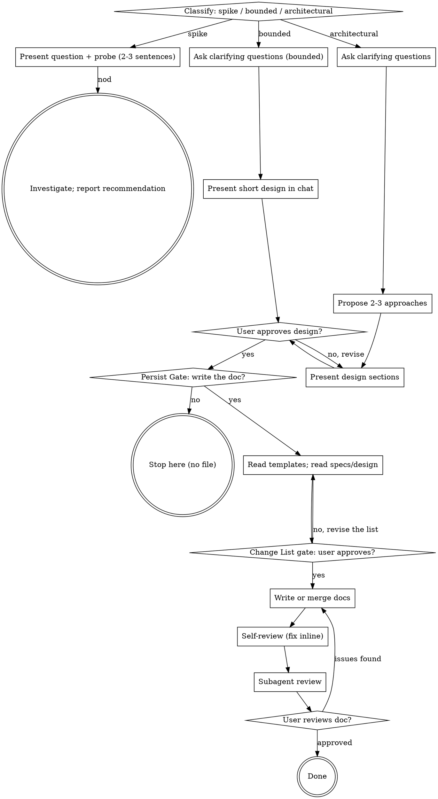

# Brainstorming Ideas Into Designs

Help turn ideas into fully formed designs through natural collaborative dialogue.

Start by classifying how much process the request needs, then work
through your path: understand the context, refine the idea, present a
design, and get your human partner's approval. Once the design has
settled and your human partner wants it kept, write it out as
human-readable design documents.

## Scope

**This skill only does this:** clarify intent → explore approaches →
settle the design → (with your human partner's consent) write a set of
human-readable design documents.

**It does NOT:**

- write code, scaffold projects, or take any implementation action
- invoke any downstream skill — no writing-plans, no implementation skills
- produce spec-mode artifacts (acceptance criteria, task lists,
  Given/When/Then, or a requirement ID used as an entry's name or
  substance — a descriptively named functional point carrying a stable
  reference label such as `FP-1` is a cross-reference aid, not spec-mode
  content, and a reference site may cite that label alone once the name
  is defined)

**Where the output goes:** your human partner hands the design documents
to a separate process (for example spec-superflow). This skill is not
responsible for that handoff.

<HARD-GATE>
Do NOT invoke any implementation skill, write any code, scaffold any
project, or take any implementation action until you have told your
human partner what you intend and they have approved it. This applies
to EVERY task on EVERY path below — the ceremony scales with the task;
the approval gate never does.
</HARD-GATE>

## Three Paths

Before your first question, classify the request and say the
classification out loud — "this looks bounded, so I'll present a short
design here rather than write a design doc" — so your human partner can
override it:

- **Spike** — a feasibility question ("can we...", "is it possible...",
  "quick and dirty is fine") whose output is an answer, not code you
  keep. Present the question and what you'll try in 2-3 sentences, get
  a nod, then find out as cheaply as correctness allows. No design
  doc. Report findings as a recommendation; anything you built stays
  labeled throwaway.
- **Bounded** — a well-scoped change whose flow is already written down in
  `specs/design/` and can be read: a field added to a class, a step inserted
  into an existing flow, one cross-module interface adjusted.
  Bounded is measured against **this repository's design document set, not
  against whether code exists** — a repository holding only design documents
  is this skill's normal case, so "there is no code yet" never by itself
  makes a task architectural. What matters is whether the flow you are
  changing is already on paper. If it is, ask the clarifying questions that
  matter, present a short design IN CHAT (a few sentences to a few short
  paragraphs), and STOP. Implementation starts only after your human partner
  says yes to that design — a bounded task's approval is as hard a gate as an
  architectural one. No document is written at this step; the Persist Gate
  comes after approval and decides whether anything is persisted at all.
- **Architectural** — new projects, new subsystems, **designing a module the
  architecture lists as 未设计**, and changes that restructure how components
  fit together or alter interfaces others depend on. Follow the full process:
  questions, approaches, sectioned design, then the Persist Gate.
  - **The approaches step is scoped to what is still open.** When you design
    a module inside an already-confirmed architecture — the usual incremental
    case — the module split, the dependencies and the cross-module interfaces
    are frozen, so proposing 2-3 whole-system approaches would argue against
    settled content. Present 2-3 approaches **for the decisions this module
    actually leaves open** (how it splits internally, where a check or a
    failure path lives, which collaborator owns what) — or state that no such
    choice is open and skip the step. Never re-open a confirmed architecture
    as though it were still undecided.

When in doubt between two paths, take the heavier one. The ratchet is
one-way: hidden complexity discovered mid-task upgrades the path —
stop, say so, and step up. Nothing downgrades mid-task.

## Anti-Pattern: "Too Simple To Need Approval"

Every path ends with your human partner approving your intent before
implementation. A todo list, a single-function utility, a config
change — the design may be two sentences in chat, but you MUST present
it and get approval. "Simple" tasks are where unexamined assumptions
cause the most wasted work. What scales with simplicity is the
artifact, never the approval.

## Red Flags

| Thought | Reality |
|---------|---------|
| "This is too simple to need a design" | Simple means a short design, not no design. Two sentences in chat, then approval. |
| "I'll call it bounded and skip the design doc" | Reaching for a label to skip work IS the doubt — take the heavier path. |
| "It's bounded and the design is obvious — I'll start while they read it" | The gate is the approval, not the design's length. Present, then stop until you hear yes. |
| "I understand this kind of app, so it's bounded" | Bounded measures the repo, not your familiarity. A new project has no existing flow — it is architectural. |
| "They just asked casually, so I'll write the doc anyway" | The Persist Gate: ask first. No consent, no file. |
| "I'll write the doc in whatever shape feels right" | Design documents MUST follow `architecture-doc-template.md` or `module-doc-template.md`, in section and in order. |
| "This is a module discussion, but I'll tidy up the architecture doc while I'm in there" | Untouched sections stay word-for-word. Only entries actually affected by this discussion may change. |
| "I know the module list well enough, I'll just write the doc" | Reading `specs/design/` first is a hard prerequisite. Writing without reading silently erases other discussions' work. |
| "Field tables look like spec mode, so I'll describe them in prose instead" | Field tables, function tables, call chains, and interface matrices are design description, not acceptance criteria. They are required, not forbidden. |
| "The design is approved, so I can write the files" | Design approval is not write approval. Present the change list and wait. |
| "The provider got designed, so that `待提供` row is handled" | It is not handled until the row is flipped to 已落地 or 有差异. An unflipped row is a gap nobody owns. |
| "I renamed the module; the file name and references can follow later" | The file name carries the module name. Rename and update every reference in the same persist, or leave a stale path behind. |
| "The spike works, so I'll keep the code" | A spike's output is an answer. Keeping the code is a new request — classify it. |
| "It grew, but I'm almost done — no need to re-classify" | Hidden complexity upgrades the path mid-task. Stop and say so. |
| "They approved the spike, so the follow-up change is approved too" | Each task gets its own classification and its own approval. |
| "We're done brainstorming, so I'll start implementing" | This skill ends at the approved set of design documents. It never implements. |

## Checklist

Classify first, announce the path, then create a task for each item on
your path and complete them in order.

**Spike:**
1. **Explore project context** — enough to frame the probe
2. **Present question + probe plan** — 2-3 sentences
3. **Get approval** — a nod is enough
4. **Investigate** — as cheaply as correctness allows
5. **Report findings** — a recommendation; label anything built as throwaway

**Bounded:**
1. **Explore project context** — check files, docs, recent commits
2. **Ask clarifying questions** — one at a time, the ones that matter
3. **Present short design in chat** — approach, files touched, testing
4. **Get approval** — STOP and wait for an explicit yes; presenting the design and starting in the same breath is skipping the gate
5. **Move to the Persist Gate** — when `specs/design/` already exists, the
   persist is an incremental merge into the affected module document.
   When the project has no design document set yet, do not manufacture an
   architecture-plus-modules set for a bounded change; write a module
   document only if your human partner asks for one.

**Architectural:**
1. **Explore project context** — check files, docs, recent commits
2. **Ask clarifying questions** — work the three-layer question list in **Understanding the idea**, in that list's order (functional-point layer → architecture layer → module layer), which maps onto the five design steps those layers name. One layer per message.
3. **Propose 2-3 approaches** — with trade-offs and your recommendation
4. **Present design** — in sections scaled to their complexity, get user approval after each section
5. **Move to the Persist Gate**

## Process Flow



**On the persist stage:** bounded and architectural share the same gates
but not the same output. A bounded change merges into the affected module
document — or writes nothing at all when the project has no document set
yet. An architectural change produces or extends the full set.

**Terminal states are path-bound.** Spike: the terminal state is a
reported recommendation. Bounded and Architectural: the terminal state
is an approved set of design documents — or no file at all when your
human partner declines the Persist Gate. This skill never continues into
implementation.

## The Process

The subsections below serve the bounded and architectural paths (a
spike stops at "present the probe, get a nod"). Sections from
**Exploring approaches** onward are architectural-path depth — for
bounded work, context plus a few questions plus a short in-chat design
is the whole process.

**Understanding the idea:**

- Check out the current project state first (files, docs, recent commits)
- Before asking detailed questions, assess scope: if the request describes multiple independent subsystems (e.g., "build a platform with chat, file storage, billing, and analytics"), flag this immediately. Don't spend questions refining details of a project that needs to be decomposed first.
- If the project is too large for a single design, help the user decompose it into functional modules: what are the independent pieces, how do they relate, what order should they be built? Then brainstorm the first module through the normal design flow. `01-架构设计.md` stays global and accumulates every module's architecture-level content; each module's detail goes in its own `<NN>-<模块名>.md`. There is only ever one architecture document.
- For appropriately-scoped projects, ask questions to refine the idea one **layer** at a time
- Prefer multiple choice questions when possible, but open-ended is fine too
- **One layer per message.** Never mix two layers' questions in the same message or the same structured-question call. Within the current layer you may ask several questions at once, up to your platform's per-call limit for the question tool; if a layer needs more, send another message for that same layer. "One message" means one user-facing message whose content is the question — do not bundle other material into it. The classification announcement the Checklist requires may share a message with the current layer's questions; that is the single exception. The "nothing else" requirement is strict only for the three gates — Persist, Change List and User Review — each of which gets a message of its own.
- Ask the clarifying questions in **three layers**. The five steps named throughout this skill — **functional points → module division → core classes → file tree → flows** — are the order the *design* is built in; the three layers are the order the *questions* are asked, mapped onto them as: the functional-point layer covers step 1; the architecture layer covers steps 2–4 plus the architecture-level skeleton of step 5; the module layer covers the module-level detail of step 5.
  - **Functional-point layer** — ask until **every** functional point is captured: which functional points does the system offer? For each, what need it serves, for whom, its input and its observable result, and its boundary (what it deliberately does not do). Which are goals and which are explicit non-goals?
  - **Architecture layer** — ask until **every** functional point and **every** functional flow is captured: how is the system cut into modules, and *why* that way (the seams, the alternative divisions rejected)? Which modules depend on which, and how strongly? Which cross-module interfaces are needed, and what does the calling side expect of each signature? Which classes are the core classes that chain the functional flows together? What do the module folders and core files look like? Deliberately defer the details — they belong to the module layer.
  - **Module layer** — only now: for each class, its fields and functions; the relationships between classes; for each declared outward dependency, the provider, class, and expected signature; and for each flow the module participates in, the function-level call chain with its data-shape changes, who receives the result, and the failure path.
- **A layer is finished when its template fields are fillable — not when the conversation feels done.** Concretely: the functional-point layer is finished when every column of architecture section 5 is answerable for every functional point; the architecture layer, when sections 6, 7, 8, 9 and the flow skeletons of 10 are answerable; the module layer, when sections 2, 3, 4 and 5 of that module's document are answerable. Before starting the next layer, list which of the current layer's template fields you still cannot fill and ask about exactly those — an unfillable field is a question you have not asked yet.
- **When the architecture is already confirmed and you are designing one module** — the normal incremental case — the functional-point and architecture layers have already been answered *by that document*. Do not re-ask them. Verify each of their template fields against the architecture you read, and ask only about the ones it genuinely leaves open or that this module changes; the questions that remain belong to the module layer.
- **A required field you cannot fill has exactly two legitimate outcomes, and proceeding as if it were filled is neither.** Either the human decides it, which answers it, or the answer would contradict an existing document — in which case it is a Rule 3 conflict: list it in the change list's **Conflicts** column and do not write the affected document until the human adjudicates. Never write `TBD`, never invent a value, and never loop on the same unanswered question.
- **Ask for rejected alternatives while you ask for decisions.** Every layer's questions should surface not only what the human chose but what they rejected, because 关键决策记录 requires the rejected option. If they state a choice without an alternative, ask what they ruled out.
- Reason for the order: a functional point or flow left vague at the functional-point or architecture layer becomes a gap every later module design inherits.

**Exploring approaches:**

- Propose 2-3 different approaches with trade-offs
- Present options conversationally with your recommendation and reasoning
- Lead with your recommended option and explain why
- YAGNI ruthlessly - remove unnecessary features from every approach and design

**Presenting the design:**

- Once you believe you understand what you're building, present the design
- Scale each section to its complexity: a few sentences if straightforward, up to 200-300 words if nuanced
- Ask after each section whether it looks right so far
- Cover the ground the templates will require: functional points; module division and its rationale; core classes with their relationships and calls; the file tree; cross-module interfaces; and the global flows. The templates decide the exact section list — inventing a section name the templates do not have is a defect.
- Be ready to go back and clarify if something doesn't make sense

**Design for isolation and clarity:**

- Break the system into smaller units that each have one clear purpose, communicate through well-defined interfaces, and can be understood and tested independently
- For each unit, you should be able to answer: what does it do, how do you use it, and what does it depend on?
- Can someone understand what a unit does without reading its internals? Can you change the internals without breaking consumers? If not, the boundaries need work.
- Smaller, well-bounded units are also easier for you to work with - you reason better about code you can hold in context at once, and your edits are more reliable when files are focused. When a file grows large, that's often a signal that it's doing too much.

**Working in existing codebases:**

- Explore the current structure before proposing changes. Follow existing patterns.
- Where existing code has problems that affect the work (e.g., a file that's grown too large, unclear boundaries, tangled responsibilities), include targeted improvements as part of the design - the way a good developer improves code they're working in.
- Don't propose unrelated refactoring. Stay focused on what serves the current goal.

## The Persist Gate

**"Settled" means you can already state the conclusion in chat** — every
open question from the layers above has been answered, whether or not the
human has yet approved the design's wording. Do not wait for design
approval before asking this question: approving the design wording belongs
to the presentation step, and the two gates are separate. Ask as soon as
the conclusion is statable.

Ask **whether they want the discussion written down as design documents.**
This question gets a message of its own — the question and nothing else.

Reason: they may have been asking casually and do not want a file out of it.

- They say **no** → stop. The conclusion already stated in chat is the
  whole output. Do not write a file, and do not ask again.
- They say **yes** → go to Writing the Design Document.
- **Anything that is neither** — a question back, a deferral, a change of
  subject → treat it as *not yet answered*: respond to what they said, then
  re-ask this gate once, as its own message. Never read a non-answer as
  consent, and never read it as a refusal either.

When an answer arrives through a structured-question tool rather than
plain text, an explicit approval option and an explicitly approving
free-text answer both count as **yes**; a deferral, a question back, or a
request for more information does not. The same rule governs the Change
List Gate and the User Review Gate: an explicit yes from any channel is
consent, and silence never is.

Example:

> "Want me to write this up as a design document? If you don't need it, we can stop here."

## Incremental Persist Protocol

Modules get designed one discussion at a time, so the output directory
accumulates. `specs/design/` already holds work from earlier
discussions, and that work must not be regenerated from scratch.

**Rule 1 — Read before writing.** Before writing any document, list
`specs/design/` and read `01-架构设计.md`: its module list, core-class list,
file tree, cross-module interface matrix, and global end-to-end flows —
plus any module document this discussion touches. This is a hard
prerequisite, not a courtesy.

**Rule 2 — Judge the blast radius, then act on the verdict.**

For each module document being worked on — a single discussion may design
more than one module, so apply this to every module document in the write
set — change only the entries this discussion is about: the classes,
fields, functions, and flows it actually reworked. Everything an earlier
discussion settled stays word-for-word. Never regenerate a module document
from scratch.

For `01-架构设计.md`:

- The discussion covers only the internals of a module that **already has
  a document** — its fields, functions, flows → **zero edits**. Not one
  word. Designing a module for the first time is *not* this case: Rules 4
  and 5 require the interface matrix and the module list to be updated in
  the same persist, so "zero edits" would be wrong there.
- The discussion affects the architecture — a module added or removed, a
  class moved between modules, a class added or removed, the file tree
  changing, module dependencies changing, a cross-module interface
  changing, a global flow's module chain changing → change **only the
  affected entries**. Everything else stays word-for-word, including its
  original phrasing, order, and formatting. The only further edits allowed
  are refreshing the 最近更新 line and the 主题 inside the 来源 line, on every
  document this persist touched, using the same date. 来源's 主题 is the topic
  of the most recent discussion that touched *that* document, so it changes
  whenever this persist touched the document and the topic differs. If the
  date is already today, or the topic already matches, the edit is a no-op:
  make no change, and add no declaration beyond the change list's own
  meta-line entry, which named the document either way. Never add or remove a
  meta line, and do not polish untouched sections while you are in the file.
- **"Affected" is judged by what this discussion made false, not by what you
  already intended to change.** An entry is affected when a statement it
  contains is no longer true after this discussion: a count that changed, a
  status that flipped, a boundary or responsibility that moved, a claim the
  new document contradicts. Scanning the document for the entries you planned
  to edit misses exactly these. So after drafting the write set, re-read every
  section that mentions anything this discussion touched and add the entries
  that have gone stale — the §8.1 prose, a module-list class count and a
  matrix row's status are the usual suspects. A change list whose affected set
  is incomplete is a defect even when every entry it *does* name is correct.
- **Decide the awkward cases by truth, not by category.** A change can look
  module-internal and architecture-affecting at once. Ask instead whether an
  existing statement has gone false. Example: a non-core source file is not
  required to appear in §9's tree, so renaming one leaves the architecture at
  **zero edits** — unless the tree already lists that file, in which case that
  one line has gone false and is an affected entry. The same test resolves
  every other case that seems to straddle the two.
- The discussion overturns the module split itself → almost every entry
  is affected at once. That is a legitimate exception to "only the
  affected entries", but not to care: announce it in the change list as
  an architecture overhaul, still walk the existing documents entry by
  entry rather than regenerating blindly, and keep whatever still holds
  word-for-word.

**Rule 3 — Conflicts are reported, not overwritten.** When this
discussion's conclusion contradicts an existing document — the human
changed their mind about a module boundary, a provider turns out to
deliver a different signature than expected — do not silently rewrite.
List the differences and let your human partner decide: update the
document, revise the design, or move it to 待定问题与风险.

**Rule 4 — Dependencies on undesigned modules are tracked.** A module
designed today may need classes, functions, or variables from a module
that does not exist yet. Record them in that module document's
dependency contract **at signature level** — expected function name,
parameters, return type, and boundary semantics — because the call site
already lives in the caller's code, so the provider's later signature is
bound by it. **This paragraph covers only the case where that provider
module does not exist yet** — Rule 4 is about undesigned modules. When the
provider is already designed, do not write `待提供`: record the row and flip
it to `已落地` or `有差异` in the same persist, per the paragraph below.
Register a `待提供` row in the architecture document's
cross-module interface matrix, and surface it in the change list,
because the human needs to know which modules are now owed a design.

When a module is designed, every `待提供` row naming it as provider must
be resolved in that same persist: flipped to `已落地` when the hard
constraints match, or to `有差异` when they do not. Leaving such a row at
`待提供` after its provider has been designed means the gap has no owner.

**Status lives only in the interface matrix.** A module document's
dependency contract states the requirement — provider, class, expected
signature, semantics — and never the status. That is what keeps flipping a
row from requiring an edit to another module's document. The full rules
live in the architecture template's section 7.

**Rule 5 — Registering a module the architecture already lists as
未设计.** Designing it completes a promise the architecture already
recorded, so the same persist also: creates `0N-<模块名>.md` from the
module template using the reserved number, flips that row's 设计状态 to
已设计, and drops the `（待创建）` marker from its 对应文档 cell. Do not
renumber, and do not add a second row for it. If one persist registers
more than one module, run this for each.

If the module is not in the list at all, it is a genuinely new module:
append it with the next free number. That is an architecture change and
is announced in the change list as such. The same applies when a
dependency contract names a module that was never registered — register
it first, then record the dependency row against it; both go into the
change list.

**Rule 6 — Removing or renaming a module.** Both are architecture
changes and both are announced in the change list.

- **Removing**: delete the module document, delete its row from the
  module list, and delete every interface-matrix row naming it as caller
  or provider. Its number is **not** reused and the remaining numbers are
  **not** shifted — a gap in the numbering is expected and harmless.
  Before deleting, scan the matrix for `待提供` rows the module owed to
  others and report them: those gaps are now unowned.
- **Renaming**: the file name carries the module name, so a rename is a
  file rename plus, in the same persist, an update of every reference to
  it — the module list's 对应文档 cell, every interface-matrix 详见 cell,
  and every cross-reference in other module documents. Never leave a
  stale path behind.

**Rule 7 — A changed entry re-renders its diagram in the same persist.** A
diagram is a derived artifact of the entries it illustrates, so it belongs to
the persist that changes those entries. When this discussion changes an entry
that carries a diagram — a global flow in the architecture's section 10, a
module flow in a module document's section 5, or the module dependency
relationship in section 6.3 — create or re-render that diagram **and its IR** in
the same persist, and list it in the change list alongside the document changes.
Entries this discussion did not touch keep their diagrams untouched, exactly as
they keep their text word-for-word: never re-render a diagram whose entry did
not change. Adding a flow adds its diagram; removing a flow removes the diagram
and IR that no longer have an entry — an orphaned diagram is a stale artifact,
not a harmless leftover. The IR is refreshed in the same persist as the diagram,
so the pair never disagrees about what was rendered.

The module list in `01-架构设计.md` section 6.2 is the single source of
truth for which modules exist; the interface matrix in section 7 is the
single source of truth for which cross-module interfaces are settled;
a module document's section 4 is the single source of truth for the
signatures of the dependencies that module declares. Every document must
agree with all three.

## Diagrams in the Design Documents

Diagrams are **sidecar SVG files** attached to a section — never inline
content, and never a user-facing feature of this skill. They are produced by
the `design-diagrams` skill, which is **internal**: this skill calls it, and it
is never invoked from a user's direct request to draw a diagram.

**When diagrams are produced.** Diagrams are produced in the persist stage, as
part of the same persist as the document entries they illustrate. They go into
the Change List Gate together with the document changes, and are written only
once that list is approved. **Never write a diagram outside the change list.**

**Who writes the IR.** You generate the typed JSON IR yourself, from what the
section **already contains**. The facts in the IR are limited to that section:
do not introduce a component, participant, state or relationship the section
does not have. Your human partner keeps talking about the design in natural
language — they do not write IR and do not need to know a schema exists.

**How to call it.** Invoke the `design-diagrams` skill with the Skill tool,
passing the diagram **type**, the **IR**, and the **target path**; it renders
the diagram and returns the validation result and the artifact paths. Its entry
point underneath is:

```bash
node <design-diagrams skill dir>/bin/design-diagrams.mjs svg <type> <ir.json> <out.svg>
```

Choose the type by the nature of what is described, never by taste:

- overall system structure (components, services, databases, cloud resources,
  security boundaries) → `architecture`
- division of labour between responsible parties or stages, with approval gates
  and exception branches (swimlanes) → `workflow`
- who calls whom, in what order, and what each step returns (API call chains,
  cache fill, authorization checks) → `sequence`
- where data comes from, what processes it, where it is stored, or where a
  sensitive-data boundary must be marked → `dataflow`
- state transitions, retries, waiting and terminal states → `lifecycle`

**Where a diagram lands, and its name.** A diagram lands at
`<directory of the design document>/diagrams/<diagram name>.svg`, and its IR
lands beside it with the same name and a `.json` extension. Derive the diagram
name from the flow name or the section's semantic name: keep letters, digits and
CJK characters, replace every other character with `-`, collapse runs of `-` into
one, strip leading and trailing `-`, and lowercase the ASCII part; if the result
is empty, fall back to the diagram type name. When two derived names collide,
append `-2`, `-3`, … and **report both sides of the collision** — never rename
silently.

**One flow, one file.** A flow name that appears in both the architecture
document and a module document shares **one** diagram file, because the two must
use the same diagram type; sharing the file removes the risk of two copies
drifting apart.

**How the document references it.** Reference the diagram with
``. The document body MUST NOT
contain an `<svg>` tag — never inline the SVG.

**The validation hard gate.** Before it produces a diagram, `design-diagrams`
runs the renderer's geometry validation (node overlap, an edge passing through an
unrelated node, occluded relationship labels). A diagram that fails validation
**is not produced**, and an existing file of the same name **is not overwritten**.

**Two-round degradation.** The target error count is the number of
**error-level** entries in the validation diagnostics — warnings do not count.
The baseline round counts as one of the two: round 1 records the baseline; if
round 2's count is **not lower** than round 1's, stop auto-fixing immediately
(exit code 3). Then report the unresolved items back — which diagram, which
diagnostic, and the current and historical counts — and put the two options,
**keep the placeholder and persist** and **keep fixing**, back to your human
partner; **do not choose for them**. If round 2 does drop, continue, and from
then on compare each round with the previous one, stopping when two consecutive
rounds fail to drop.

**When the environment is unsuitable.** If the environment has no Node meeting
the required version (minimum **18**), skip the diagram, leave a placeholder in
the document saying why, and mark that state in the change list. This degradation
**never blocks the document from being persisted**.

## Change List Gate

An approved design does not authorise writing files. Before any file is
created or modified, present a change list and wait for an explicit yes.
The change list states:

- **New files** — path, and which template each follows
- **Modified files** — path, and for each one exactly which sections or
  entries change, and why. **Separate two kinds of modification**, because
  they carry different authorisation: entries this discussion reworked, and
  entries corrected because a Rule 3 adjudication made an earlier document
  stale — mark the latter `由裁决连带修正（用户裁决即授权）`.
- **Explicitly untouched** — which existing documents and sections stay
  word-for-word unchanged, so the human can see nothing is being lost.
  On a first persist, when nothing pre-exists, write `无既有文档`. Include
  the meta lines: state which documents get 最近更新 / 来源 refreshed. Name the
  document whether or not the refresh turns out to be a no-op, so that a no-op
  later needs no separate declaration — the entry is the declaration.
- **Interface-matrix changes** — every row this persist adds, and whether it
  stays `待提供` or flips. When every provider involved is already designed,
  write `无新增待提供行（相关行同批翻 已落地 / 有差异）`. This field is never
  blank, and it is not "none" merely because no module ends up owed a design.
- **Core-class reconciliation** — every §8.1 entry this persist moves from
  provisional registration (owned by a 未设计 module) into a designed module's
  section 2.1 class list, or `无`. This column exists because the architecture
  template and self-review item 8 require that reconciliation while no other
  column has a place for it.
- **Diagrams** — every diagram this persist will create or re-render, each named
  with the flow or section it belongs to (per Rule 7 and **Diagrams in the
  Design Documents**), or `无`. A diagram whose entry did not change is not
  listed and is not re-rendered.
- **Conflicts** — every Rule 3 difference awaiting a decision
- **Notes** — anything the human needs in order to judge the list: an
  inference you filled in on their behalf, an entry you widened beyond what
  they named, or a capability you are declaring unavailable.

Build this list from an **affected-set sweep, not from what you intended to
edit**: before drafting it, re-read every section that mentions anything this
discussion touches — module-list class counts, a module's 设计状态 and its
`（待创建）` marker, interface-matrix statuses, §8.1's provisional-registration
prose, flow names and their 服务功能点 — and include the statements that have
gone false. Self-review item 12 re-runs this same sweep after writing to
confirm the result; running it only afterwards is too late for this gate.

This list is **open-ended**: the items above are the minimum, and adding a
note costs nothing. Omitting one of them does.

Then stop. A "go ahead" approves the list; anything else means revise the
list first.

## The Three Gates

Your human partner is asked three separate times in one session. They
guard different things, and merging them loses the protection each one
gives — do not collapse them into a single question.

1. **Persist Gate** — *should anything be written at all?* Asked once the
   design has settled. A "no" ends the session with the chat conclusion as
   the whole output.
2. **Change List Gate** — *what exactly will be written or changed?* Asked
   before any file is touched. Cheap to answer, and it is what stops a
   multi-discussion document set from being quietly overwritten.
3. **User Review Gate** — *is what was written correct?* Asked after
   self-review and the subagent review have passed. This is the only gate
   that asks them to read prose.

The first two can be answered in seconds. Only the third needs real
reading time.

## Writing the Design Document

1. **Read both templates first** — `architecture-doc-template.md` and
   `module-doc-template.md` in this skill's directory. This step is
   mandatory.
2. **Read the existing output set** — per the Incremental Persist
   Protocol, Rule 1. Then decide the write set: what is new, what is
   merged, and which entries change in each document.
3. **Present the change list and get approval** — per the Change List
   Gate. Nothing is written before that approval.
4. **Fill each template exactly** — keep every section, in order. Do not
   add, remove, or rename sections. For a section that does not apply,
   keep its heading and write `不适用：<reason>`.
5. **Write to** `<project-root>/specs/design/<NN>-<name>.md` — the path is
   relative to the project root, not to the current working directory.
   Create `specs/design/` first if it does not exist.
   - `01-架构设计.md` is fixed for the architecture document
   - Module documents are named after the functional module and numbered
     after the current maximum. **Append, never renumber** — inserting a
     new module in the middle would rename existing files and break the
     references between them. Module names are unique project-wide; two
     modules may not share one.
   - No date prefix, no `docs/` prefix
   - If your human partner names a location, use theirs
6. **Self-review** (below)
7. **Subagent review** (below)
8. **Ask your human partner to review** the documents

## Document Format Requirements

- **Hybrid form** — narrative prose for responsibilities, boundaries, class
  relationships, and business flows; tables for fields, functions, and
  dependencies. The tables are mandatory, not optional: a class with no
  field table and no function table is an incomplete class — **unless that
  table is marked `不适用` with a reason** (a pure data class has no
  functions; a stateless class has no fields).
- **No spec mode — and that is not a licence to drop structure** —
  forbidden: acceptance criteria, task lists, Given/When/Then, and a
  requirement ID used as an entry's name or substance (a descriptively
  named functional point carrying a stable reference label such as
  `FP-1` is a cross-reference aid, not spec-mode content). A reference
  site may cite the label alone once that functional point's descriptive
  name is defined in the same document or in the architecture's section 5.
  Required and explicitly allowed: field tables,
  function signature tables, call chains, data-shape tables, cross-module
  interface matrices. These describe a design; they do not state
  acceptance conditions. Never downgrade a table to prose because it
  "looks like spec mode".
- **Cross-references use one form** — when a document points at another
  document, write the path relative to the project root in full, e.g.
  `specs/design/02-通信模块.md`. Never a bare file name, never a
  `docs/`-prefixed variant, never a `../` relative hop.
- **Language follows the conversation** — a Chinese conversation produces a Chinese document, an English conversation an English one. The template's section structure stays fixed; section headings may be translated when the conversation is not Chinese. Code identifiers (class, field, function names) stay in their original form.
- **Concrete** — no `TBD`, `TODO`, or empty sections. Anything still undecided goes under the "待定问题与风险" section with the reason it is undecided.

## Self-Review (immediately after writing)

Check each item and fix in place:

1. **Template compliance per document:** Has each document been checked against its own template — architecture against `architecture-doc-template.md`, each module against `module-doc-template.md`? Every section present, in order, no extra sections?
2. **Placeholder scan:** Any `TBD`, `TODO`, unfilled `<...>`, or empty sections?
3. **Internal consistency:** Do any sections contradict each other? Does the recommended approach match the comparison's conclusion?
4. **Ambiguity check:** Can any sentence be read two ways? Pick one reading and make it explicit.
5. **Decision traceability:** Does every key decision state its rationale and the rejected alternatives?
6. **Scope check:** Is each document focused on a single design — one architecture, or one module — rather than several independent subsystems?
7. **Incremental merge integrity:** For every document that already existed, are the untouched sections word-for-word unchanged? Has any content belonging to other modules, or produced by earlier discussions, been dropped?
8. **Cross-document consistency:** Is the architecture's core-class list a subset of the union of the **already-designed** module documents' class lists — with no class owned by two modules, and no core class left without an owning module once its module is designed (a core class belonging to a module that is still 未设计 is registered provisionally and must be reconciled into that module's section 2.1 class list when the module is designed, via the `待提供` flip machinery)? Do the dependency-contract entries and the interface-matrix rows cover each other as **sets** — a module's contract may legitimately carry several entries, including class-only references whose signature is `—`, against a single matrix row, so compare the sets rather than the row counts? Does every **functional** flow appear in the architecture's global flow section under the same name — including one that completes inside a single module — while a purely module-internal **implementation** flow must not be registered there, and do that registered flow and its same-named flow in a module document agree on the 服务功能点 they serve? Does every reference resolve — no pointer to a renamed or deleted module, no orphan module document whose module is missing from the list?
9. **Dependency closure:** Is every `待提供` row in the interface matrix whose provider module has now been designed flipped to `已落地` or `有差异`? An unflipped row means the gap has no owner. And is status absent from every module document's dependency contract — it belongs only in the matrix?
10. **Coverage completeness:** Does every functional point in the architecture's section 5 have at least one section 10 flow serving it, and does every section 10 flow name at least one functional point — the two sets covering each other in both directions, with no functional point left claimed by no module? **(module)** Does every class in the class list have a detailed-design entry with both a field table and a function table — or an explicit `不适用` with a reason where one of them genuinely does not apply? Does every cross-module call named in a function table appear in the dependency contract? **(architecture)** Does the file tree reach module folders and core files only, with every **core** class's `定义文件` locatable in it? A non-core class's source file need not appear and its absence is not a defect — the module documents' class lists are the authority for the complete class inventory.
11. **Read-before-write:** Was `specs/design/` actually read before anything was written, and does the write set match what the approved change list described? If the change list was never approved, stop and report that — it is a process failure, not a wording issue.
12. **Write-set completeness — the *affected* set, not the *planned* set:** This is the **second** run of the sweep that built the change list — the first ran before anything was written, and this one verifies the result. Items 7 and 11 check that what you declared untouched is untouched, and that you wrote what you said you would. Neither catches a stale statement you never noticed. So re-read every section that mentions anything this discussion touched — a module-list class count, a module's 设计状态 and its `（待创建）` marker, interface-matrix statuses, §8.1's provisional-registration prose, flow names and their 服务功能点 — and confirm that each statement which has gone false is either in the write set or explicitly recorded as still true. Then **state the sweep's result**: which sections you re-read, and either the entries you added or `no additional stale statements found`. A change list that names only the entries you meant to edit, while a count or a status that this discussion invalidated sits unchanged, is a defect.

## Subagent Review

After self-review passes, dispatch a review subagent using
`design-doc-reviewer-prompt.md` in this skill's directory. Pass it:

- the path to every document in the write set
- the path to both templates — `architecture-doc-template.md` and
  `module-doc-template.md`
- the approved change list itself: which files are new, which are modified
  and in which sections, what was declared untouched, every new
  dependency, any pending conflict, and whether it was announced as an
  architecture overhaul. The reviewer needs the whole list, not just the
  untouched part — the merge-integrity check depends on knowing what the
  approved scope actually was.

One subagent reviews both document types. Route each document to its
template: `01-架构设计.md` follows the architecture template, every other
document follows the module template.

When the write set exceeds five documents, split the review: review
`01-架构设计.md` first, then dispatch the module documents in batches,
carrying the architecture findings into each later batch so the
cross-document checks still have their reference.

- Verdict **approved** → go to the user review gate. Do **not** act on the
  reviewer's advisory recommendations by default — they do not block and were
  not part of the approved design. Raise them to your human partner instead
  of silently applying them.
- Verdict **issues found** → fix in place, then re-run self-review, then
  re-review. Send **one** fix round that addresses *every* finding of the same
  family at once; repairing the first instance and letting the reviewer
  rediscover the same class of defect next round is not convergence.
  Re-review whenever the fix changed a conclusion, a decision, or a flow; a
  wording-only or typo fix needs self-review alone.
  - **Fixing in place beats "leaving it alone".** The incremental protocol's
    "everything else stays word-for-word" governs entries this discussion did
    not touch. When the review finds a defect in an existing, already
    confirmed statement, fixing it is correct — but that is a Rule 3 change to
    another discussion's work, so name it in the change list and let the human
    adjudicate before editing it. Recording it as a 风险 or 待定 item instead
    does **not** discharge it: a registered risk is not a fix.
  - **Convergence:** if two consecutive rounds keep producing findings of the
    same kind, stop and report the pattern rather than looping. Three rounds
    without convergence is the point to escalate.
- **When you cannot dispatch a subagent** — the capability is absent, or the
  environment forbids it — do not claim the review happened. Say so plainly,
  then perform one independent second pass yourself under the same rules,
  keeping the reviewer's output format, and record in your report that it was
  self-performed and why. The User Review Gate still opens, with that
  limitation stated in its message. Never merge this gate into another, and
  never present a self-performed pass as a dispatched one.

## User Review Gate

> "Design documents written to `<paths>`. Please review them and let me know if you want any changes before we stop."

Wait for the response. If they request changes, make them and re-run
self-review. Once they approve, stop.

## Terminal State

This skill **ends here**.

- Do not invoke any further skill
- Do not create an implementation plan or start implementing
- **Committing is the repository's convention, not this skill's decision.**
  If the project has a standing rule requiring a commit after file changes
  (a project instruction file, or an established convention), commit the
  documents you wrote and the entries you changed, using that project's
  message format. If there is no such convention, say the working tree is
  left as-is and why.
- You may tell your human partner: "These documents can be handed to spec-superflow for the next stage."
- **If, before the Persist Gate, they ask you to hand the work to a
  downstream process right away**, say plainly that this skill finishes at
  the documents and that the handoff becomes possible once they exist. Do not
  promise or start a handoff you cannot complete.
