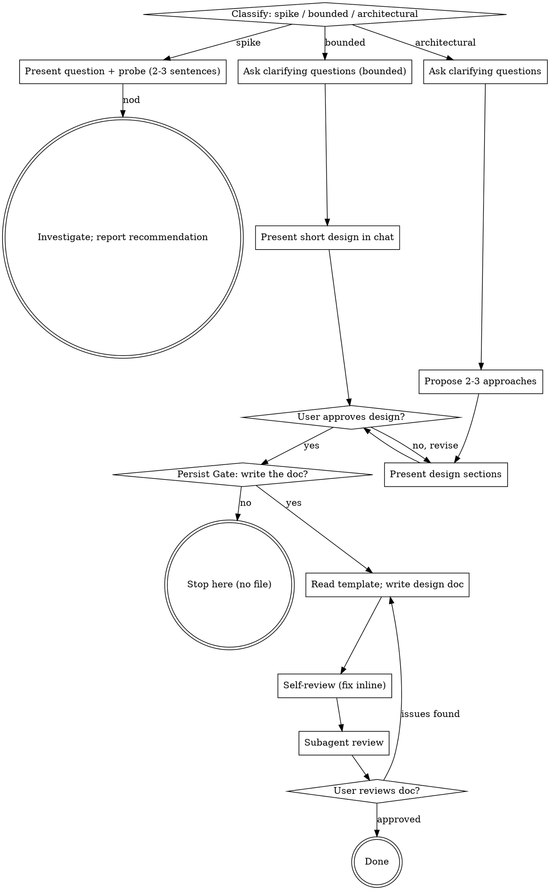

# Brainstorming Ideas Into Designs

Help turn ideas into fully formed designs through natural collaborative dialogue.

Start by classifying how much process the request needs, then work
through your path: understand the context, refine the idea, present a
design, and get your human partner's approval. Once the design has
settled and your human partner wants it kept, write it out as a
human-readable design document.

## Scope

**This skill only does this:** clarify intent → explore approaches →
settle the design → (with your human partner's consent) write a
human-readable design document.

**It does NOT:**

- write code, scaffold projects, or take any implementation action
- invoke any downstream skill — no writing-plans, no implementation skills
- produce spec-mode artifacts (requirement IDs, acceptance criteria,
  task lists, Given/When/Then)

**Where the output goes:** your human partner hands the design document
to a separate process (for example spec-superflow). This skill is not
responsible for that handoff.

<HARD-GATE>
Do NOT invoke any implementation skill, write any code, scaffold any
project, or take any implementation action until you have told your
human partner what you intend and they have approved it. This applies
to EVERY task on EVERY path below — the ceremony scales with the task;
the approval gate never does.
</HARD-GATE>

## Three Paths

Before your first question, classify the request and say the
classification out loud — "this looks bounded, so I'll present a short
design here rather than write a design doc" — so your human partner can
override it:

- **Spike** — a feasibility question ("can we...", "is it possible...",
  "quick and dirty is fine") whose output is an answer, not code you
  keep. Present the question and what you'll try in 2-3 sentences, get
  a nod, then find out as cheaply as correctness allows. No design
  doc. Report findings as a recommendation; anything you built stays
  labeled throwaway.
- **Bounded** — a well-scoped change to code that already exists in
  this repo: a new flag, a small endpoint, a one-file fix.
  Understanding the kind of app is not enough — bounded means the flow
  you are changing is already here to read. If there is no existing
  flow to change, the task is not bounded. Ask the clarifying
  questions that matter, present a short design IN CHAT (a few
  sentences to a few short paragraphs), and STOP. Implementation
  starts only after your human partner says yes to that design — a
  bounded task's approval is as hard a gate as an architectural
  one. No design doc is written during this step.
- **Architectural** — new projects, new subsystems, changes that
  restructure how components fit together or alter interfaces others
  depend on. Follow the full process: questions, approaches, sectioned
  design, then the Persist Gate.

When in doubt between two paths, take the heavier one. The ratchet is
one-way: hidden complexity discovered mid-task upgrades the path —
stop, say so, and step up. Nothing downgrades mid-task.

## Anti-Pattern: "Too Simple To Need Approval"

Every path ends with your human partner approving your intent before
implementation. A todo list, a single-function utility, a config
change — the design may be two sentences in chat, but you MUST present
it and get approval. "Simple" tasks are where unexamined assumptions
cause the most wasted work. What scales with simplicity is the
artifact, never the approval.

## Red Flags

| Thought | Reality |
|---------|---------|
| "This is too simple to need a design" | Simple means a short design, not no design. Two sentences in chat, then approval. |
| "I'll call it bounded and skip the design doc" | Reaching for a label to skip work IS the doubt — take the heavier path. |
| "It's bounded and the design is obvious — I'll start while they read it" | The gate is the approval, not the design's length. Present, then stop until you hear yes. |
| "I understand this kind of app, so it's bounded" | Bounded measures the repo, not your familiarity. A new project has no existing flow — it is architectural. |
| "They just asked casually, so I'll write the doc anyway" | The Persist Gate: ask first. No consent, no file. |
| "I'll write the doc in whatever shape feels right" | The design document MUST follow `design-doc-template.md`, in section and in order. |
| "The spike works, so I'll keep the code" | A spike's output is an answer. Keeping the code is a new request — classify it. |
| "It grew, but I'm almost done — no need to re-classify" | Hidden complexity upgrades the path mid-task. Stop and say so. |
| "They approved the spike, so the follow-up change is approved too" | Each task gets its own classification and its own approval. |
| "We're done brainstorming, so I'll start implementing" | This skill ends at the approved design document. It never implements. |

## Checklist

Classify first, announce the path, then create a task for each item on
your path and complete them in order.

**Spike:**
1. **Explore project context** — enough to frame the probe
2. **Present question + probe plan** — 2-3 sentences
3. **Get approval** — a nod is enough
4. **Investigate** — as cheaply as correctness allows
5. **Report findings** — a recommendation; label anything built as throwaway

**Bounded:**
1. **Explore project context** — check files, docs, recent commits
2. **Ask clarifying questions** — one at a time, the ones that matter
3. **Present short design in chat** — approach, files touched, testing
4. **Get approval** — STOP and wait for an explicit yes; presenting the design and starting in the same breath is skipping the gate
5. **Move to the Persist Gate**

**Architectural:**
1. **Explore project context** — check files, docs, recent commits
2. **Ask clarifying questions** — one at a time, understand purpose/constraints/success criteria
3. **Propose 2-3 approaches** — with trade-offs and your recommendation
4. **Present design** — in sections scaled to their complexity, get user approval after each section
5. **Move to the Persist Gate**

## Process Flow

**Terminal states are path-bound.** Spike: the terminal state is a
reported recommendation. Bounded and Architectural: the terminal state
is an approved design document — or no file at all when your human
partner declines the Persist Gate. This skill never continues into
implementation.

## The Process

The subsections below serve the bounded and architectural paths (a
spike stops at "present the probe, get a nod"). Sections from
**Exploring approaches** onward are architectural-path depth — for
bounded work, context plus a few questions plus a short in-chat design
is the whole process.

**Understanding the idea:**

- Check out the current project state first (files, docs, recent commits)
- Before asking detailed questions, assess scope: if the request describes multiple independent subsystems (e.g., "build a platform with chat, file storage, billing, and analytics"), flag this immediately. Don't spend questions refining details of a project that needs to be decomposed first.
- If the project is too large for a single design, help the user decompose into sub-projects: what are the independent pieces, how do they relate, what order should they be built? Then brainstorm the first sub-project through the normal design flow. Each sub-project gets its own design document.
- For appropriately-scoped projects, ask questions one at a time to refine the idea
- Prefer multiple choice questions when possible, but open-ended is fine too
- Only one question per message - if a topic needs more exploration, break it into multiple questions
- Focus on understanding: purpose, constraints, success criteria

**Exploring approaches:**

- Propose 2-3 different approaches with trade-offs
- Present options conversationally with your recommendation and reasoning
- Lead with your recommended option and explain why
- YAGNI ruthlessly - remove unnecessary features from every approach and design

**Presenting the design:**

- Once you believe you understand what you're building, present the design
- Scale each section to its complexity: a few sentences if straightforward, up to 200-300 words if nuanced
- Ask after each section whether it looks right so far
- Cover: architecture, components, data flow, error handling, testing
- Be ready to go back and clarify if something doesn't make sense

**Design for isolation and clarity:**

- Break the system into smaller units that each have one clear purpose, communicate through well-defined interfaces, and can be understood and tested independently
- For each unit, you should be able to answer: what does it do, how do you use it, and what does it depend on?
- Can someone understand what a unit does without reading its internals? Can you change the internals without breaking consumers? If not, the boundaries need work.
- Smaller, well-bounded units are also easier for you to work with - you reason better about code you can hold in context at once, and your edits are more reliable when files are focused. When a file grows large, that's often a signal that it's doing too much.

**Working in existing codebases:**

- Explore the current structure before proposing changes. Follow existing patterns.
- Where existing code has problems that affect the work (e.g., a file that's grown too large, unclear boundaries, tangled responsibilities), include targeted improvements as part of the design - the way a good developer improves code they're working in.
- Don't propose unrelated refactoring. Stay focused on what serves the current goal.

## The Persist Gate

Once the design has settled, **ask your human partner whether they want
the discussion written down as a design document.** This question gets a
message of its own — the question and nothing else.

Reason: they may have been asking casually and do not want a file out of it.

- They say **no** → stop. The conclusion already stated in chat is the
  whole output. Do not write a file, and do not ask again.
- They say **yes** → go to Writing the Design Document.

Example:

> "Want me to write this up as a design document? If you don't need it, we can stop here."

## Writing the Design Document

1. **Read the template first** — `design-doc-template.md` in this
   skill's directory. This step is mandatory.
2. **Fill the template exactly** — keep every section, in order. Do not
   add, remove, or rename sections. For a section that does not apply,
   keep its heading and write `不适用：<reason>`.
3. **Write to** `docs/specs/design/YYYY-MM-DD-<topic>.md`
   - `<topic>` is a short English or Chinese phrase, hyphenated
   - If your human partner names a location, use theirs
4. **Self-review** (below)
5. **Subagent review** (below)
6. **Ask your human partner to review** the document

## Document Format Requirements

- **Narrative prose** — full sentences explaining context, trade-offs, and conclusions
- **No spec mode** — no requirement IDs, acceptance criteria, task lists, or Given/When/Then
- **Language follows the conversation** — a Chinese conversation produces a Chinese document, an English conversation an English one. The template's section structure stays fixed; section headings may be translated when the conversation is not Chinese.
- **Concrete** — no `TBD`, `TODO`, or empty sections. Anything still undecided goes under the "待定问题与风险" section with the reason it is undecided.

## Self-Review (immediately after writing)

Check each item and fix in place:

1. **Template compliance:** Is every template section present, in order, with no extra sections?
2. **Placeholder scan:** Any `TBD`, `TODO`, unfilled `<...>`, or empty sections?
3. **Internal consistency:** Do any sections contradict each other? Does the recommended approach match the comparison's conclusion?
4. **Ambiguity check:** Can any sentence be read two ways? Pick one reading and make it explicit.
5. **Decision traceability:** Does every key decision state its rationale and the rejected alternatives?
6. **Scope check:** Is this focused on a single design, not several independent subsystems?

## Subagent Review

After self-review passes, dispatch a review subagent using
`design-doc-reviewer-prompt.md` in this skill's directory, passing it
the design document's path.

- Verdict **approved** → go to the user review gate
- Verdict **issues found** → fix in place, then re-run self-review. Then
  re-review with a subagent whenever the fix changed a conclusion, a
  decision, or a flow. A wording-only or typo fix needs self-review alone.

## User Review Gate

> "Design document written to `<path>`. Please review it and let me know if you want any changes before we stop."

Wait for the response. If they request changes, make them and re-run
self-review. Once they approve, stop.

## Terminal State

This skill **ends here**.

- Do not invoke any further skill
- Do not create an implementation plan or start implementing
- You may tell your human partner: "This document can be handed to spec-superflow for the next stage."
